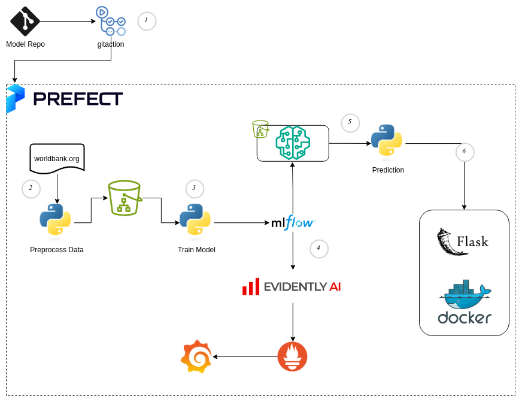
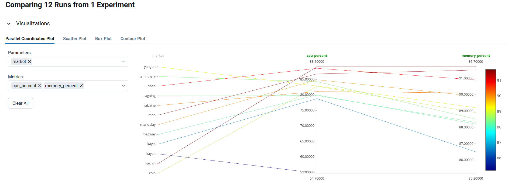
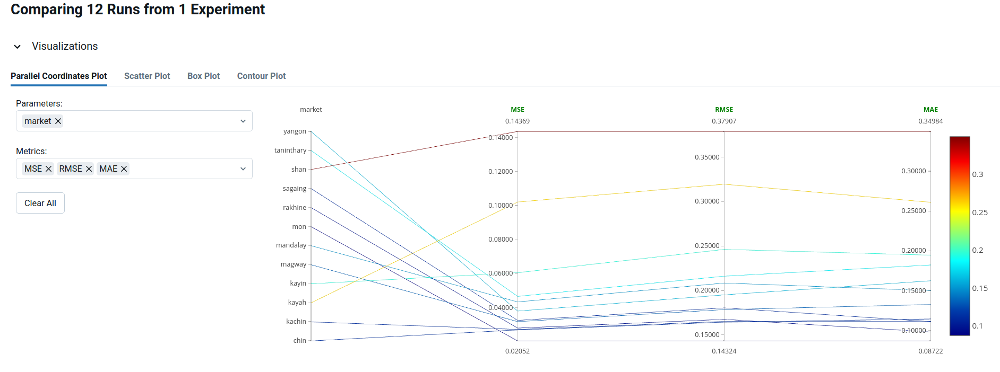
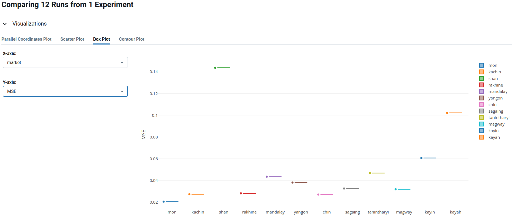
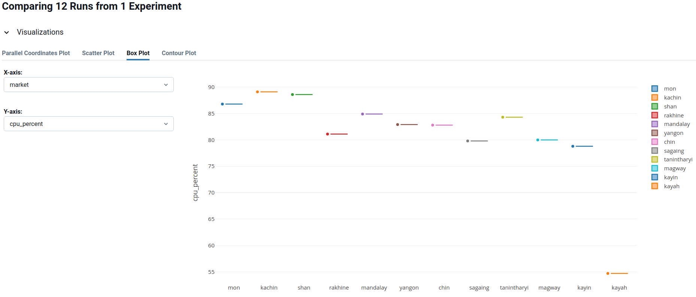
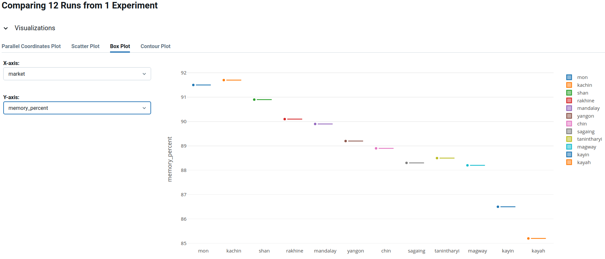

# Rice Price Forecasting

Rice price forecasting is critical for Myanmar’s economy. The models are trained on historical rice price data for different regions and can be used to predict future prices. The goal is to predict rice prices accurately, considering market dynamics, historical data, and external factors. We’ll leverage Machine Learning (ML) techniques, specifically Long Short-Term Memory (LSTM) networks, to achieve this. Additionally, we’ll implement MLOps practices to streamline the development and deployment process.

# Architecture



## Data Catalog

In this scenerio, dataset was gathered from [worldbank.org](https://microdata.worldbank.org/index.php/catalog/4501/data-dictionary/MMR_2021_RTFP_MKT?file_name=MMR_RTFP_mkt_2008_2024-06-17.csv) .

| ID   | Name              | Label                      | Definition                                                                                                                                                                                                                                                                                                                                                                                                                                                                                                                                                                                                                                                                                                                                                                                                                                                                                                                                                                                                                                                                                                                                                                                                                                                                            |
| :--- | :---------------- | :------------------------- | :------------------------------------------------------------------------------------------------------------------------------------------------------------------------------------------------------------------------------------------------------------------------------------------------------------------------------------------------------------------------------------------------------------------------------------------------------------------------------------------------------------------------------------------------------------------------------------------------------------------------------------------------------------------------------------------------------------------------------------------------------------------------------------------------------------------------------------------------------------------------------------------------------------------------------------------------------------------------------------------------------------------------------------------------------------------------------------------------------------------------------------------------------------------------------------------------------------------------------------------------------------------------------------ |
| V001 | ISO3              | Country Code               | ISO3C codes, also known as ISO 3166-1 alpha-3 codes, are three-letter country or territory codes that are part of the ISO 3166 international standard.<br />These codes are used to uniquely represent and identify countries and dependent territories in a standardized manner. <br />Each ISO3C code corresponds to a specific country or territory and is often used in various applications, such as international trade, banking, internet domain names,<br /> and statistical analysis, to simplify and standardize country and territory references.                                                                                                                                                                                                                                                                                                                                                                                                                                                                                                                                                                                                                                                                                                                          |
| V002 | country           | Country                    | Country names follow their appearance in the World Bank World Development Indicators.                                                                                                                                                                                                                                                                                                                                                                                                                                                                                                                                                                                                                                                                                                                                                                                                                                                                                                                                                                                                                                                                                                                                                                                                 |
| V003 | adm1_name         | Area name (admin, level1)  | Administrative names follow their appearance in the underlying data bases from the World Food Program, FAO and HDX and may be further simplified for better machine readability.<br />As such, these names may differ from official names.                                                                                                                                                                                                                                                                                                                                                                                                                                                                                                                                                                                                                                                                                                                                                                                                                                                                                                                                                                                                                                            |
| V004 | adm2_name         | Area name (admin, level 2) | Administrative names follow their appearance in the underlying data bases from the World Food Program, FAO and HDX and may be further simplified for better machine readability.<br />As such, these names may differ from official names.                                                                                                                                                                                                                                                                                                                                                                                                                                                                                                                                                                                                                                                                                                                                                                                                                                                                                                                                                                                                                                            |
| V005 | mkt_name          | Market name                | The mkt_name variable represents the name of the market associated with each price data point in the dataset.<br />This field provides a clear, textual identifier for each market location, offering a more intuitive and user-friendly way to reference and distinguish between different markets. <br />The market name is crucial for qualitative analysis and for users familiar with regional market names, facilitating easy identification and comparison of market-specific trends and patterns. Market names follow their appearance in the underlying data bases from the World Food Program, FAO and HDX and may be further simplified for better machine readability. <br />As such, these names may differ from official names. When analyzing market price data, geo_id helps in correlating price information with specific, named market locations, enhancing the contextual understanding of the data. Note that market names may change over time, market names may be shared between multiple geographic locations, and that multiple markets may share similar coordinates, while the geo_id is unique for each location.                                                                                                                                        |
| V006 | lat               | Latitude                   | Geographic positioning of the market location at which price data is tracked, expressed as a geographic coordinate that measure the east-west positioning on Earth relative to the Prime Meridian in Greenwich, England. Use the geo_id field to obtain a better understanding of unique market locations.<br />Note that market names may change over time, market names may be shared between multiple geographic locations, and that multiple markets may share similar coordinates.                                                                                                                                                                                                                                                                                                                                                                                                                                                                                                                                                                                                                                                                                                                                                                                               |
| V007 | lon               | Longitude                  | Geographic positioning of the market location at which price data is tracked, expressed as a geographic coordinate that measure the north-south positioning on Earth relative to the equator. Use the geo_id field to obtain a better understanding of unique market locations.<br />Note that market names may change over time, market names may be shared between multiple geographic locations, and that multiple markets may share similar coordinates.                                                                                                                                                                                                                                                                                                                                                                                                                                                                                                                                                                                                                                                                                                                                                                                                                          |
| V008 | geo_id            | Market location identifier | The geo_id variable serves as a unique identifier for each market location in the RTP datasets, derived from geographic coordinates.<br />This identifier is essential for accurately linking market price data to specific geographical locations. <br />It ensures precise tracking and comparison of prices across different areas and is particularly useful for spatial analysis and mapping trends geographically. <br />The uniqueness of each geo_id aids in the clear distinction and aggregation of data by location, making it a key element in any geographical or location-based analysis of market prices. <br />The geo_id is shared across Real Time Food Prices (RTFP), Real Time Energy Prices (RTEP) and Real Time Exchange Rates (RTFP) that share the same timestamp (RTP data are generated weekly, they share the same timestamp when they are in the same week). <br />The geo_id may be used to link data sets from different time periods, but caution is recommended. <br />Use also the mkt_name field and Longitude and Latitude to obtain a better understanding of the market location, while noting that market names may change over time, market names may be shared between multiple locations, or multiple markets may share similar coordinates. |
| V009 | price_date        | Date in yyyy-mm-dd format  |                                                                                                                                                                                                                                                                                                                                                                                                                                                                                                                                                                                                                                                                                                                                                                                                                                                                                                                                                                                                                                                                                                                                                                                                                                                                                       |
| V010 | year              | Year                       | The year variable represents the year associated with each market price data point, provided in numerical format (e.g., 2023).<br />This field is allows segmenting and analyzing the price data on an annual basis.                                                                                                                                                                                                                                                                                                                                                                                                                                                                                                                                                                                                                                                                                                                                                                                                                                                                                                                                                                                                                                                                  |
| V011 | month             | Month                      | The month variable indicates the month number (1-12) corresponding to each market price data point, presented in a numerical format.<br />This field facilitates more granular temporal insights and may be used to calculate seasonal adjustments to inflation estimates by the user.                                                                                                                                                                                                                                                                                                                                                                                                                                                                                                                                                                                                                                                                                                                                                                                                                                                                                                                                                                                                |
| V014 | start_dense_data  | Start dense data           |                                                                                                                                                                                                                                                                                                                                                                                                                                                                                                                                                                                                                                                                                                                                                                                                                                                                                                                                                                                                                                                                                                                                                                                                                                                                                       |
| V015 | last_survey_point | Last survey point          |                                                                                                                                                                                                                                                                                                                                                                                                                                                                                                                                                                                                                                                                                                                                                                                                                                                                                                                                                                                                                                                                                                                                                                                                                                                                                       |
| V055 | rice              | Rice                       |                                                                                                                                                                                                                                                                                                                                                                                                                                                                                                                                                                                                                                                                                                                                                                                                                                                                                                                                                                                                                                                                                                                                                                                                                                                                                       |
| V209 | o_rice            | Open estimate - Rice       | o_rice indicates the monthly opening price estimate for the commodity rice.<br />It represents the initial market price at the start of each month, crucial for analyzing the opening market sentiment and baseline valuation. <br />In financial analysis, especially in OHLC (Open, High, Low, Close) objects, the opening price is key to understanding the initial market conditions. <br />Open price estimates are estimated as conditional means using a fractionally integrated GARCH (Generalized Autoregressive Heteroscedasticity) model estimated using a Generalized Error Distribution that allows for excess kurtosis. <br />These data points are instrumental in plotting the price data in candlestick charts, which are pivotal for visual market analysis and identifying potential price trends, intra-month price volatility, or observe trend reversals that are significant when contrasted to natural monthly price spreads.                                                                                                                                                                                                                                                                                                                                 |
| V210 | h_rice            | High estimate - Rice       | h_rice denotes the highest price achieved by the commodity rice within a month.<br />This data point captures market peaks, reflecting the maximum demand or valuation during the period. <br />High price estimates are estimated as the expected value of the upper half of the price distribution based on conditional variance estimated using a fractionally integrated GARCH (Generalized Autoregressive Heteroscedasticity) model estimated using a Generalized Error Distribution that allows for excess kurtosis. <br />These data points are instrumental in plotting the price data in candlestick charts, which are pivotal for visual market analysis and identifying potential price trends, intra-month price volatility, or observe trend reversals that are significant when contrasted to natural monthly price spreads. <br />In candlestick charting, the high price is indicated by the upper shadow or wick, marking the top end of the price range. <br />Understanding the highest price point helps analyze the monthly price spread and market volatility.                                                                                                                                                                                                  |
| V211 | l_rice            | Low estimate - Rice        | l_rice represents the lowest price point for the commodity rice in the given month.<br />This variable is essential for understanding market dips, buyer interest at lower prices, and the floor value of the commodity.<br /> Low price estimates are estimated as the expected value of the lower half of the price distribution based on conditional variance estimated using a fractionally integrated GARCH (Generalized Autoregressive Heteroscedasticity) model estimated using a Generalized Error Distribution that allows for excess kurtosis. <br />In candlestick charting, the low price forms the lower end of the candle or wick, showcasing the lowest market reach. Analyzing the low price is integral to understanding the full monthly price range and assessing market stability or distress.                                                                                                                                                                                                                                                                                                                                                                                                                                                                    |
| V212 | c_rice            | Close estimate - Rice      | c_rice is the closing price estimate for the commodity rice at the end of each month.<br />This figure indicates the final market price as recorded in the underlying surveys or estimated contemporaneously based on the other recorded price data, reflecting the closing market sentiment and valuation after a month's trading activity.<br /> In candlestick charts, the closing price helps form the main body of the candle, indicating the final standing of the market. <br />It is vital for evaluating the closing market conditions, final demand, and forming comparative analysis with the opening price to understand market dynamics over the month.                                                                                                                                                                                                                                                                                                                                                                                                                                                                                                                                                                                                                  |
|      | inflation_rice    |                            | inflation_rice provides the 12-month inflation rate, or price change rate, for commodity rice.<br />This metric is calculated by comparing the current price against the price from 12 months prior, giving an annualized percentage change. <br />Inflation rates are crucial economic indicators, reflecting the purchasing power and cost of living changes. <br />For a more comprehensive understanding of overall inflation, analyzing a basket of food items rather than single commodities is recommended, as it offers a broader perspective of general price trends. <br />This data is instrumental in economic planning, policy making, and understanding the macroeconomic environment.                                                                                                                                                                                                                                                                                                                                                                                                                                                                                                                                                                                  |
|      | trust_rice        |                            | trust_rice offers a trust score, ranging from 1-10, reflecting the reliability of the inflation calculation for rice.<br />These scores are specific to each market, time period, and commodity, considering the data availability and accuracy for the preceding 12 months. <br />Higher scores indicate greater confidence and robustness in the inflation figures, based on the quality and quantity of data used and the cross-validated accuracy of imputed data. <br />This score is key for users to assess the credibility and dependability of the inflation data, aiding in more informed economic and financial analysis. A score of 10 corresponds to an entry for which up to 12 months of preceding data has been fully observed. <br />Values below 6 highlight observations generated with extremely low confidence.                                                                                                                                                                                                                                                                                                                                                                                                                                                  |

## Project Structure

```
.
├── config.py
├── data
│   ├── input.csv
│   ├── model
│   ├── plots
│   └── process
├── docker-compose.yml
├── Dockerfile
├── logs
├── PredictionAPI
│   ├── app
│   ├── config.py
│   ├── run.py
│   └── wsgi.py
├── README.md
├── requirements.txt
├── setup.py
└── utils
    ├── evaluation.py
    ├── loadmodel.py
    ├── main.py
    ├── predict.py
    ├── preprocessing.py
    └── train.py
```

## Getting Started

### 1. Initialize the Environment

1. Clone the repository:

   ```bash
   git clone https://github.com/lillianphyo/mlopsprj022024.git
   cd mlopsprj022024
   ```
2. Create a virtual environment and activate it:

   ```bash
   python3 -m venv .venv
   source .venv/bin/activate
   ```
3. Install the required dependencies:

   ```bash
   pip install -r requirements.txt
   <or>
   pip install -e .
   ```

### 2. Train the Model

To train the LSTM models for each market, you can use the `setup.py` script. The command will train the model and log the training process, including accuracy metrics like MAE, RMSE, and MSE, to MLflow.

1. Train the model:
   ```bash
   python setup.py train
   <or>
   train-model
   ```

### 3. Run Tests

To ensure that the project components are working correctly, you can run tests using `pytest`.

1. Run the tests:
   ```bash
   python setup.py test
   ```

### 4. Run the Flask Prediction API

You can expose the trained model as a Flask API using Docker. The API allows you to make predictions for specific regions based on the latest available data.

1. Build and run the Docker container:

   ```bash
   docker-compose up --build
   ```
2. The API should now be running at `http://localhost:5000`. You can use `curl` or any other tool to make requests to the API.

### 5. Example `curl` Command

Here’s an example of how to use `curl` to make a prediction:

```bash
curl -X POST http://localhost:5000/predict \
-H "Content-Type: application/json" \
-d '{
    "geo_id": "yangon",
    "o_rice": 1050,
    "h_rice": 1070,
    "l_rice": 1030,
    "c_rice": 1060
}'
```

This command sends a request to the prediction API with the latest rice prices for the Yangon region. The API will return the predicted price.

### 6. MLFLOW

To run the training model with ml flow, please use /mlflow folder. Please make sure, running the mlflow before training the model. Incert the mlflow url in config.py.

```
...
mlflow_tracking_uri = 'http://localhost:8080'
```

```
mlflow server --host 127.0.0.1 --port 8080
```

```
python mlflow/main.py
```

### The Metric from MLflow

The Exprement Metrics from MLflow are as follow.













## Logging and Monitoring

- **MLflow**: Logs and tracks model training, including accuracy metrics.
- **Logging**: Logs the training process and model summaries.

## License

This project is licensed under the MIT License - see the [LICENSE](LICENSE) file for details.
